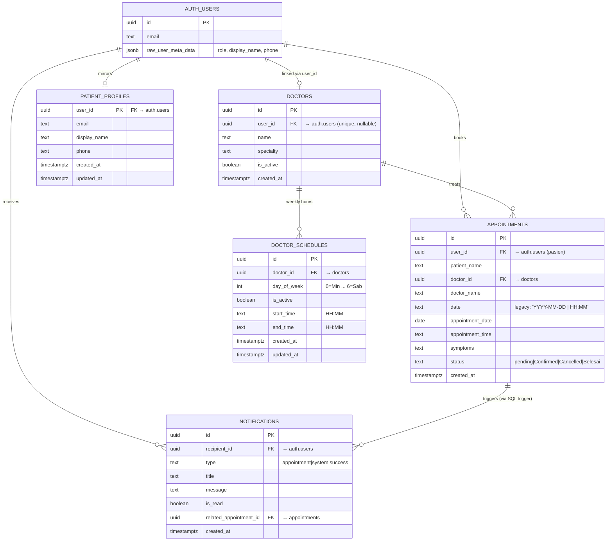
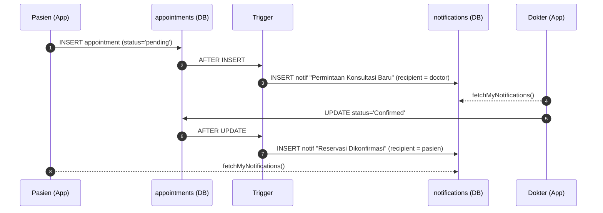

# 🏥 MAD Healthcare — Aplikasi Reservasi Klinik

Aplikasi mobile klinik kesehatan **multi-role** (Pasien, Dokter, Admin) yang dibangun dengan **React Native + Expo** dan **Supabase** sebagai backend.
Project ini merupakan **Final Project** mata kuliah *Mobile Application Development (MAD)* — mencakup autentikasi berbasis role, reservasi konsultasi, manajemen jadwal dokter, notifikasi real‑time, serta dashboard administrasi.

---

## ✨ Fitur Utama

### 👤 Pasien (User)
- Registrasi & login email/password.
- Melihat daftar dokter aktif beserta spesialisasinya.
- Booking konsultasi (memilih dokter, tanggal, jam, dan keluhan).
- Validasi slot real‑time (tidak bisa double‑book pada slot yang sudah diambil).
- Riwayat & antrean appointment (`pending`, `Confirmed`, `Cancelled`, `Selesai`).
- Notifikasi otomatis ketika status appointment berubah.
- Edit profil, pengaturan notifikasi, help center, dan halaman About.

### 🩺 Dokter (Doctor)
- Login khusus portal dokter (akun di‑provision oleh Admin).
- Dashboard: ringkasan appointment hari ini & permintaan baru.
- Konfirmasi / batalkan / tandai *Selesai* setiap appointment.
- Pengaturan **jadwal mingguan** (Senin–Minggu, jam buka/tutup, hari aktif/libur).
- Inbox notifikasi permintaan konsultasi baru.
- Halaman *Earnings* (ringkasan layanan & estimasi pemasukan).
- Edit profil dokter.

### 🛠️ Admin (Staff Klinik)
- Login portal staff dengan gate khusus (`AdminGate` → `AdminLogin`).
- Manajemen daftar dokter (tambah, edit, aktif/nonaktif, hapus).
- Tautkan akun Auth (Supabase) ke profil dokter (`user_id` link).
- Melihat semua appointment di klinik (lintas pasien & dokter).
- Akses ke profil pasien (email, nama, telepon) sesuai RLS Supabase.

---

## 🧰 Tech Stack

| Lapisan | Teknologi |
|---|---|
| **Framework** | [Expo SDK 54](https://docs.expo.dev/) + React Native `0.81.5` |
| **Bahasa** | TypeScript `~5.9` |
| **Navigasi** | `@react-navigation/native-stack` + `@react-navigation/bottom-tabs` |
| **UI / Ikon** | `@expo/vector-icons` (Ionicons) + komponen custom theme |
| **Backend / Auth / DB** | [Supabase](https://supabase.com/) (Postgres + Row Level Security + Triggers) |
| **Testing** | Jest + `@testing-library/react-native` + `ts-jest` / `jest-expo` |

---

## 📂 Struktur Proyek

```
final-project/
├── App.tsx                       # Root navigator + auth state listener
├── index.ts                      # Expo entry point
├── supabase.ts                   # Inisialisasi Supabase client
├── app.json                      # Konfigurasi Expo
├── package.json                  # Dependencies & scripts
│
├── Screens/
│   ├── index.ts                  # Barrel export semua screen
│   ├── auth/                     # RoleSelection, Login, DoctorLogin, AdminGate, AdminLogin
│   ├── user/                     # Home, BookAppointment, Profile (pasien)
│   ├── doctor/                   # Dashboard, Appointments, Schedule, Earnings, Notifications
│   ├── admin/                    # AdminUserScreen (manajemen dokter & user)
│   ├── shared/                   # MainTabNavigator, MyAppointments, EditProfile, Help, About
│   ├── components/               # UI primitives (Button, Card, InputField, dll.)
│   ├── constants/                # theme.ts (warna, tipografi, spacing, shadow)
│   ├── services/                 # Layer abstraksi Supabase (auth, appointment, doctor, dll.)
│   └── types/                    # Tipe TypeScript bersama (Appointment, Doctor, UserRole, ...)
│
├── supabase/
│   └── migrations/               # SQL skema, RLS policies, triggers
│
└── __tests__/                    # Unit test (Jest)
```

---

## 🧭 Arsitektur Navigasi

`App.tsx` mengarahkan user berdasarkan **role** di `user_metadata` Supabase:

- ❌ Belum login → `RoleSelection` → (`Login` / `DoctorLogin` / `AdminGate → AdminLogin`)
- ✅ Role `user` / `admin` → `MainTabs` (bottom tabs)
- ✅ Role `doctor` → `DoctorMain` (stack khusus dokter)

Bottom tab `MainTabNavigator` adaptif: pasien melihat tab **Beranda / Jadwal / Profil**, sedangkan admin melihat **Beranda / Users / Profil**.

---

## 🗄️ Skema Database (Supabase)

Migrasi SQL berada di `supabase/migrations/`:

- `2026-04-19_harden_clinic_schema.sql` — memperketat tabel `doctors` & `appointments`, menambahkan unique constraint slot, helper `is_admin()`, dan RLS policies per role.
- `2026-04-26_add_notifications_schedules_profiles.sql` — menambah tabel `patient_profiles`, `doctor_schedules`, `notifications`, plus trigger otomatis pembuat notifikasi.

Tabel utama:

| Tabel | Tujuan |
|---|---|
| `doctors` | Master data dokter, terhubung ke `auth.users` lewat `user_id`. |
| `appointments` | Reservasi pasien (status: `pending`, `Confirmed`, `Cancelled`, `Selesai`). |
| `doctor_schedules` | Jadwal mingguan dokter (per `day_of_week`). |
| `notifications` | Notifikasi otomatis untuk pasien & dokter. |
| `patient_profiles` | Mirror akun pasien dari `auth.users` (email, nama, telepon). |

### 📐 Diagram Relasi (ERD)



**Catatan relasi:**

- `auth.users` adalah tabel bawaan **Supabase Auth**. Role user (`user` / `doctor` / `admin`) disimpan di `raw_user_meta_data.role`.
- Slot appointment dijaga *unique* via partial index: `(doctor_id, appointment_date, appointment_time)` saat `status != 'Cancelled'` — mencegah double‑booking.
- Tabel `notifications` **tidak punya policy INSERT** untuk client. Semua notifikasi dibuat **otomatis** oleh trigger `appointment_notification_trigger` saat `INSERT` / `UPDATE` di `appointments`.
- Trigger `on_auth_user_created` mem‑populate `patient_profiles` setiap kali user baru daftar dengan role `user`.

### 🔔 Alur Notifikasi Otomatis



> **Catatan keamanan**: semua tabel mengaktifkan **Row Level Security**. Lihat policy di file migrasi untuk detail siapa boleh `select`/`insert`/`update`/`delete`.

---

## 🚀 Memulai (Setup Lokal)

### 1. Prasyarat

- [Node.js](https://nodejs.org/) **18+** (disarankan LTS terbaru).
- npm **9+** (atau Yarn / pnpm).
- [Expo Go](https://expo.dev/client) terpasang di HP Android/iOS, **atau** Android Studio / Xcode untuk emulator.
- Akun [Supabase](https://supabase.com/) (gratis) bila ingin pakai backend sendiri.

### 2. Clone & Install

```bash
git clone https://github.com/<username>/<repo>.git
cd final-project
npm install
```

### 3. Konfigurasi Supabase

Buka `supabase.ts` dan ganti `supabaseUrl` serta `supabaseAnonKey` dengan kredensial proyek Supabase kamu sendiri:

```ts
const supabaseUrl = 'https://<project-ref>.supabase.co';
const supabaseAnonKey = '<anon-public-key>';
```

> Untuk produksi, pindahkan kredensial ke environment variable (mis. `expo-constants` + `app.config.ts`) — jangan commit kunci sensitif.

### 4. Jalankan Migrasi Database

Di dashboard Supabase → **SQL Editor**, jalankan **berurutan**:

1. `supabase/migrations/2026-04-19_harden_clinic_schema.sql`
2. `supabase/migrations/2026-04-26_add_notifications_schedules_profiles.sql`

Setelah itu, buat akun **admin** & **doctor** via Supabase Auth (Authentication → Users → *Add user*) lalu set field `user_metadata.role` menjadi `"admin"` atau `"doctor"`. Akun `user` (pasien) bisa daftar sendiri via aplikasi.

### 5. Jalankan Aplikasi

```bash
# Mulai Metro bundler + tampilkan QR
npm start

# Atau langsung ke platform tertentu
npm run android   # emulator/HP Android
npm run ios       # simulator iOS (macOS only)
npm run web       # browser
```

Scan QR code dengan **Expo Go** untuk mencobanya di HP fisik.

---

## 🧪 Testing

Unit test ditulis dengan **Jest** dan mock layer Supabase, fokus pada *service layer* (`appointmentService`, `authService`).

```bash
# Jalankan semua test sekali
npm test

# Mode watch
npm run test:watch

# Type-check tanpa emit
npm run typecheck
```

File test berada di `__tests__/`.

---

## 🔑 Skrip NPM

| Skrip | Fungsi |
|---|---|
| `npm start` | Menjalankan Metro bundler (Expo Dev Server). |
| `npm run android` | Build & launch ke device/emulator Android. |
| `npm run ios` | Build & launch ke simulator iOS (macOS). |
| `npm run web` | Menjalankan versi web React Native Web. |
| `npm test` | Menjalankan Jest (`--runInBand`). |
| `npm run test:watch` | Jest mode watch. |
| `npm run typecheck` | TypeScript `tsc --noEmit`. |

---

## 🧩 Service Layer

Semua interaksi dengan Supabase dibungkus di `Screens/services/`, sehingga UI tetap bersih:

- `authService.ts` — login, signup, logout, validasi role.
- `appointmentService.ts` — CRUD appointment + cek slot terbooking.
- `doctorService.ts` — CRUD master dokter + toggle status aktif.
- `scheduleService.ts` — fetch & upsert jadwal mingguan dokter.
- `notificationService.ts` — daftar notifikasi, mark‑as‑read, format waktu relatif (Bahasa Indonesia).

---

## 🎨 Design System

Tema terpusat di `Screens/constants/theme.ts` (warna, radius, shadow, spacing, tipografi). Komponen UI reusable berada di `Screens/components/ui/`:

`Brand`, `Button`, `Card`, `IconBadge`, `InfoBanner`, `InputField`, `ScreenHeader`, `States`, `StatusBadge`.

Aksen warna utama: **teal** (kesehatan & ketenangan), dipasangkan dengan layout *card‑based* dan bottom tab pill highlight.

---

## 🗺️ Roadmap Singkat

- [ ] Push notification (Expo Notifications) untuk reminder appointment.
- [ ] Pencarian & filter dokter berdasarkan spesialisasi.
- [ ] Riwayat pembayaran / integrasi gateway.
- [ ] Mode gelap (dark mode).
- [ ] Internationalization (i18n) — saat ini default Bahasa Indonesia.

---

## 📝 Lisensi

Project ini dirilis di bawah lisensi **0BSD** (lihat field `license` di `package.json`). Silakan dipakai untuk pembelajaran dan modifikasi.

---

## 🙋 Kontribusi & Kontak

Project ini merupakan tugas akhir akademik. Issue, saran, dan pull request tetap dipersilakan untuk pengembangan lanjutan.

> Dibuat dengan ❤️ menggunakan React Native, Expo, dan Supabase.
